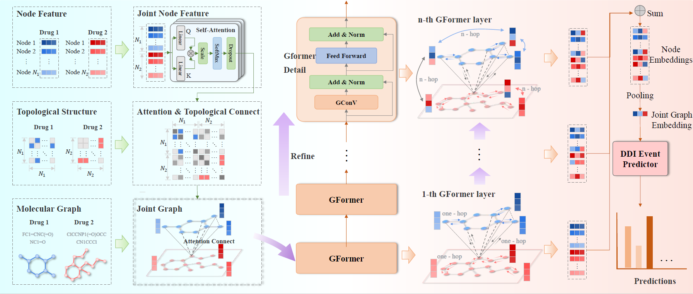

# MolBridge: Atom-Level Joint Graph Refinement for Robust Drug-Drug Interaction Prediction

## Introduction

Drug combinations offer therapeutic benefits but also carry the risk of adverse drug–drug interactions (DDIs), especially under complex molecular structures. Accurate DDI event prediction requires capturing fine-grained inter-drug relationships, which are critical for modeling metabolic mechanisms such as _enzyme-mediated competition_. However, existing models typically rely on isolated drug representations and are limited to modeling atom-level cross-molecular interactions explicitly. To address this gap, we propose MolBridge, a novel atom-level joint graph refinement framework for robust DDI event prediction. MolBridge constructs a unified graph that integrates atomic structures of drug pairs, enabling direct modeling of inter-drug associations. To further capture long-range association while mitigating over-smoothing, we introduce a graph residual network that iteratively refines node features and preserves global structural context. This joint design allows MolBridge to effectively learn both local and global interaction patterns, yielding robust representations across both frequent and rare DDI types. Extensive experiments on two benchmark datasets show that MolBridge consistently outperforms state-of-the-art baselines, with at least 2.19\% and 2.49\% improvements in Macro-F1 and Macro-Recall, respectively. These results demonstrate the advantages of fine-grained graph refinement in improving the accuracy, robustness, and mechanistic interpretability of DDI prediction.

Paper link: XXXXXXXXX




## Installation and Dependencies

### Requirements

- Python 3.9
- PyTorch 2.4.0 (with CUDA 11.8 support)
- PyTorch Geometric 2.6.1
- RDKit 2024.9.6
- scikit-learn 1.6.1
- numpy
- pandas
- tqdm
- PyYAML
- matplotlib (for visualization)

### Setup

```bash
# Clone the repository

# Create and activate virtual environment (optional but recommended)
python -m venv venv
source venv/bin/activate  # On Windows: venv\Scripts\activate

# Install PyTorch with CUDA support
pip install torch==2.4.0 torchvision==0.19.0 torchaudio==2.4.0 --index-url https://download.pytorch.org/whl/cu118

# Install PyTorch Geometric and its dependencies
pip install torch-geometric==2.6.1
pip install torch-scatter torch-sparse torch-cluster torch-spline-conv -f https://data.pyg.org/whl/torch-2.4.0+cu118.html

# Install other dependencies
pip install rdkit scikit-learn numpy pandas tqdm pyyaml matplotlib
```

## Usage

### Model Configuration

The model parameters can be configured in the `config.yml` file:

```yaml
# Model selection
model_name: 'MolBridge'

# Experiment name
experiment_name: '3d2-num3'

# Cross-validation settings
folds: [0, 1, 2, 3, 4]

# Device configuration
device: 'cuda:0'

# Training parameters
train:
  batch_size: 512
  lr: 0.005
  epochs: 500
  loss_fn: 'CrossEntropyLoss'
  optimizer:
    name: 'AdamW'
    weight_decay: 0.01
  dropout: 0.1
  num_workers: 4
  seed: 42

# Model architecture parameters
model:
  block:
    num: 3
    ffn:
      hidden_dim: 2048
  mlp:
    hidden_dim: 256
  attn_heads: 4
  is_a_: true
  is_rg: true
  alpha: 0.0
  is_alpha_learn: true
  is_eye: true
  is_joint: true

# Data parameters
data:
  source: "Deng"
  num_classes: 65
  atom_dim: 75
  atom_hid_dim: 256
  clip_num_atom: 50
```

### Data Preparation

The model expects data in CSV format with drug SMILES strings and interaction labels:

```python
# Dataset format example
"""
smile_1,smile_2,label
CC1=CC=C(C=C1)C(=O)OCCN(C)C,CC(=O)C1=CC=C(N)C=C1,23
CC(C)CC1=CC=C(C=C1)C(C)C(=O)O,CCN(CC)CC,7
...
"""
```

### Training the Model

```python
# Run training with specified configuration
python main.py
```

The training process includes:

1. Loading and preprocessing molecular data
2. Converting SMILES to graph representations
3. Training the GRN-DDI model with cross-validation
4. Evaluating model performance on validation and test sets

### Using the Trained Model for Prediction

```python
import torch
from src.models.mymodel import MyModel
from src.datasets.dataloader.feature_encoding import smile_to_graph

# Load trained model
model_path = "best_model.pth"
model = MyModel()
model.load_state_dict(torch.load(model_path, weights_only=True))
model.eval()

# Prepare drug pair data
def prepare_drug_pair(smile1, smile2, device):
    # Convert SMILES to graph representations
    # (Implementation details as per src/datasets/dataloader/collate_fn.py)
    # ...
    return embeds, adjs, masks, cnn_masks

# Make prediction
drug1_smiles = "CC1=CC=C(C=C1)C(=O)OCCN(C)C"
drug2_smiles = "CC(=O)C1=CC=C(N)C=C1"
inputs = prepare_drug_pair(drug1_smiles, drug2_smiles, device="cuda:0")
with torch.no_grad():
    scores, _ = model(*inputs, torch.zeros(1))
    predicted_class = torch.argmax(scores, dim=1).item()
    print(f"Predicted interaction class: {predicted_class}")
```

## Evaluation Metrics

The model's performance is evaluated using the following metrics:

1. **Accuracy**: The proportion of correctly predicted interactions.

   ```
   accuracy = correct_predictions / total_predictions
   ```

2. **Macro Precision**: The average precision across all classes.

   ```
   macro_precision = sum(precision_per_class) / num_classes
   ```

3. **Macro Recall**: The average recall across all classes.

   ```
   macro_recall = sum(recall_per_class) / num_classes
   ```

4. **Macro F1 Score**: The harmonic mean of precision and recall, averaged across all classes.

   ```
   macro_f1 = 2 * (macro_precision * macro_recall) / (macro_precision + macro_recall)
   ```

These metrics are computed for both validation and test sets during model training, with the best model checkpoint saved based on combined F1 score and accuracy performance.

## Citation

If you use this code in your research, please cite:

```
XXXXXXXX
```
